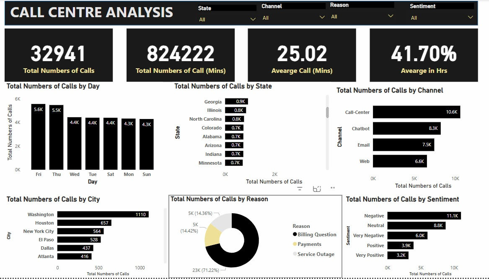

# call_centre_analysis
Call centers play a critical role in customer service for many companies, acting as the primary point of contact between the company and its customers.

---
# Problem Statement 
The primary objective of this project is to analyze call centre operations to identify key areas for improvement. By leveraging data analytics, the project aims to enhance both efficiency and customer satisfaction. Specific objectives include:

1.	Total Number of calls on each day over the specified period⏲️
2.	Geographical Analysis📊 on received calls.
3.	Sentimental😄 Analysis on calls. 
4.	Call Centre Breakdown 
5.	The top reasons for calls in relation to inflows of calls 
6.	Channels breakdown and performance rating 

---

# VISUALIZATION

# Data Insights:
1. Day of Week Analysis
Peak Call Volume on Friday: Friday recorded the highest call volume (5,570), surpassing Sunday (the lowest at 4,296) by 29.66%, indicating potential end-of-week customer urgency or operational trends.

Weekday Variability: Total calls across days ranged from 4,296 (Sunday) to 5,570 (Friday), suggesting moderate fluctuations in demand.

2. Channel Performance
Call-Center Dominance:

Call-Center handled 10,639 calls, 61.79% higher than Web (6,576), reflecting a strong preference for voice support.

Contributed 32.30% of total call volume, outperforming Chatbot, Email, and Web.

Channel Disparity: Call volume across channels spanned 6,576 (Web) to 10,639 (Call-Center), highlighting uneven customer engagement by channel.

3. Inquiry Type Breakdown
Billing Questions Drive Volume:

Billing inquiries dominated at 23,462 calls, representing 71.22% of total volume.

Outpaced Payments (4,749) and Service Outage (4,730) by 5x, signaling potential billing process or communication issues.

4. Geographic Distribution
Top Cities:

Washington led with 1,110 calls (3.37% of total), followed by Houston and New York City.

Long-Tail Distribution: Across 461 cities, call volume ranged from 7 to 1,110, indicating highly fragmented demand with most cities contributing minimally.

Actionable Recommendations
Investigate Billing Query Surge: Audit billing processes, FAQs, or customer education materials to reduce repetitive inquiries.

Optimize Channel Resources: Allocate more staff to Call-Center during peak days (e.g., Fridays) and improve self-service options for Web/Chatbot.

Regional Focus: Prioritize support for high-volume cities (e.g., Washington) while analyzing low-volume regions for potential service gaps.

Sunday Low Volume: Explore root causes for reduced Sunday activity (e.g., limited hours, customer preferences) to align staffing.
